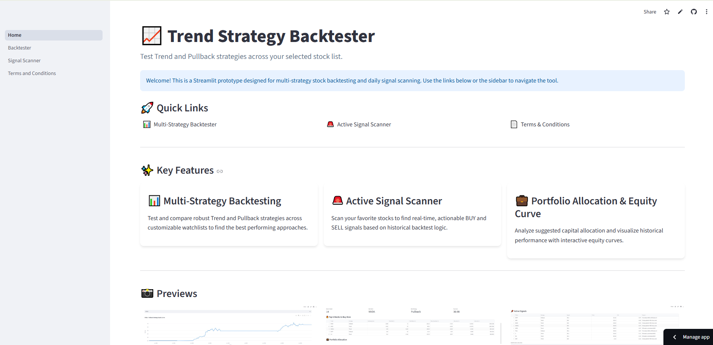
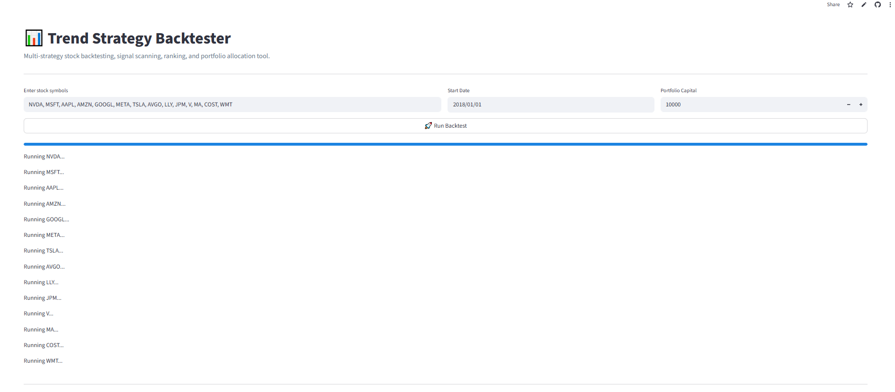
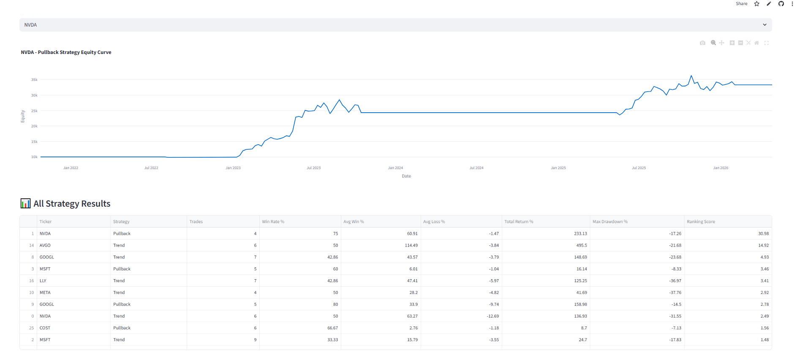
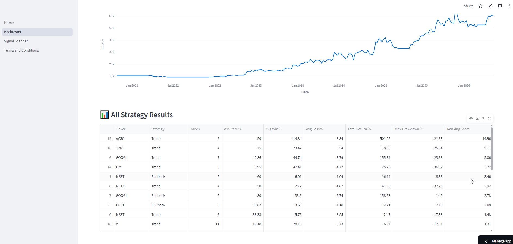
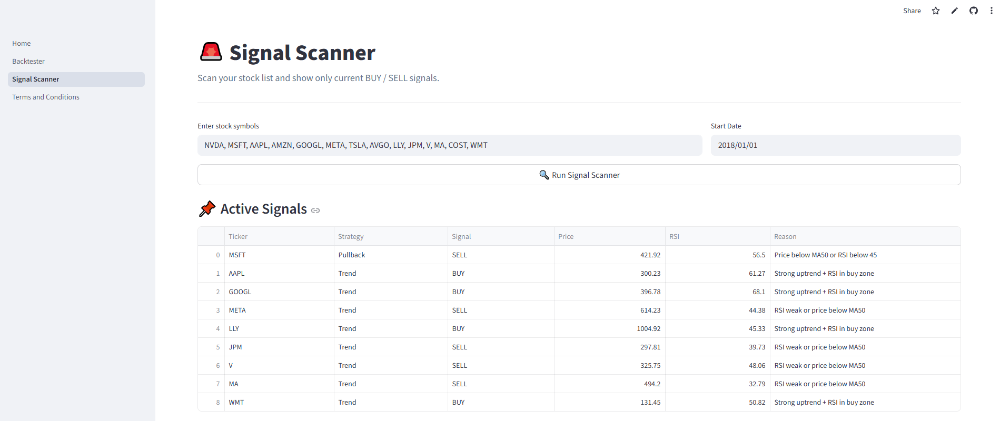
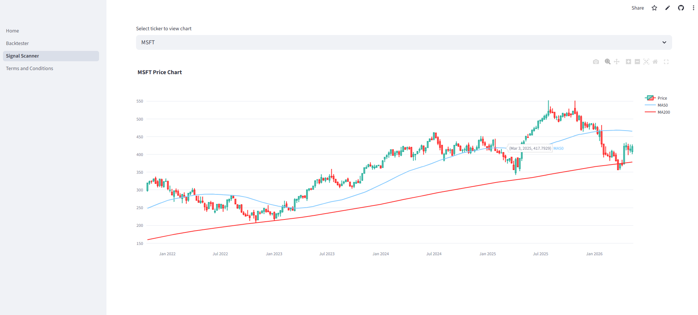
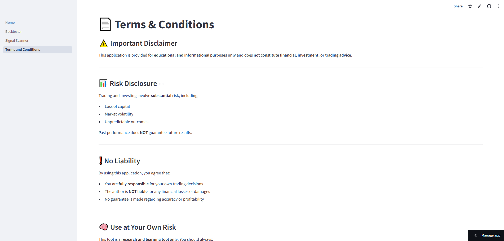

# 📊 Trend Strategy Backtester

🚀 **Live App:**  
👉 https://trendstrategybacktester.streamlit.app/

---

A multi-strategy stock backtesting and signal scanning platform built with **Python + Streamlit**.

This tool helps identify high-quality buy/sell opportunities by combining **trend-following** and **pullback strategies**, then ranking stocks based on historical performance.

---

## 🖼️ App Screenshots

### 🏠 Home Page


### 📊 Backtester & Results




### 📌 Active Signal Scanner



### 📄 Terms & Conditions


---

## ✨ Features

- 📈 Trend Strategy (MA50 / MA200 + RSI)
- 🔄 Pullback Strategy (dip + breakout logic)
- 🧪 Multi-stock backtesting
- 🏆 Automatic best strategy selection per stock
- 💼 Portfolio allocation (Top 5 stocks)
- 📊 Equity curve visualization
- 🚨 Signal Scanner (real-time BUY / SELL alerts)
- 🌐 Live deployed web app

---

## 🧠 How It Works

1. Input a list of stocks (e.g. NVDA, TSLA, META)
2. Backtest both strategies on each stock
3. Select the best-performing strategy
4. Rank stocks using a scoring system
5. Display:
   - Top 5 stocks to buy
   - Suggested allocation
   - Equity curves
6. Scan for **current BUY / SELL signals**

---

## 📌 Example Output

```text
TSLA → Pullback Strategy → BUY signal  
NVDA → Pullback Strategy → HOLD  
META → Trend Strategy → SELL  
```

## ⚠️ DISCLAIMER

This application is provided for educational and informational purposes only and does not constitute financial, investment, or trading advice.

The strategies, signals, and backtesting results are based on historical data and do not guarantee future performance
Trading and investing involve significant risk, including the potential loss of capital
No representation is made that any strategy will achieve profits or avoid losses

By using this application, you acknowledge that:

You are solely responsible for your own investment decisions
You understand and accept all risks involved in trading
The author is not liable for any financial losses, damages, or outcomes resulting from the use of this tool

👉 Always perform your own research and consult a licensed financial advisor before making investment decisions.
